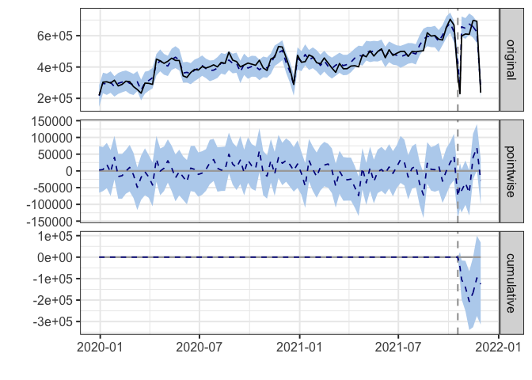

Causal Inference on Listing level price test
================

## T1

``` r
library(CausalImpact)
```

    ## Loading required package: bsts

    ## Loading required package: BoomSpikeSlab

    ## Loading required package: Boom

    ## Loading required package: MASS

    ## 
    ## Attaching package: 'Boom'

    ## The following object is masked from 'package:stats':
    ## 
    ##     rWishart

    ## 
    ## Attaching package: 'BoomSpikeSlab'

    ## The following object is masked from 'package:stats':
    ## 
    ##     knots

    ## Loading required package: zoo

    ## 
    ## Attaching package: 'zoo'

    ## The following objects are masked from 'package:base':
    ## 
    ##     as.Date, as.Date.numeric

    ## Loading required package: xts

    ## 
    ## Attaching package: 'bsts'

    ## The following object is masked from 'package:BoomSpikeSlab':
    ## 
    ##     SuggestBurn

``` r
library(zoo)

##########################################################
# Experiment overall analysis
##########################################################

####### T1 ######
# GMV 
gmv_t1 <- read.csv("weekly_pv_gmv_t1.csv", sep = ',',header = TRUE)
gmv_t1 <- gmv_t1[order(gmv_t1$period, decreasing=TRUE), ]
gmv_t1 <- gmv_t1[order(gmv_t1$week), ]
#head(gmv_t1)
#dim(gmv_t1)

# Construct control and test gmv_t1
gmv_t1[,1] <- as.Date(gmv_t1[,1],  format="%Y-%m-%d")
#head(gmv_t1)

# Define date 
times=as.Date(gmv_t1[,1])
pre.period <- c(min(which(gmv_t1$period=='pre')), max(which(gmv_t1$period=='pre')))
post.period <- c(min(which(gmv_t1$period=='post')), max(which(gmv_t1$period=='post')))


X = gmv_t1[, 3:8, 10]
y = gmv_t1[, 9]
# gmv_t1 is (test, control, date)
fit_gmv_t1=zoo(cbind(y, X),times)
# Model fit
impact <- CausalImpact(fit_gmv_t1,times[pre.period] , times[post.period])
summary(impact)
```

    ## Posterior inference {CausalImpact}
    ## 
    ##                          Average            Cumulative        
    ## Actual                   524910             3674371           
    ## Prediction (s.d.)        542879 (14226)     3800156 (99583)   
    ## 95% CI                   [515148, 569781]   [3606037, 3988465]
    ##                                                               
    ## Absolute effect (s.d.)   -17969 (14226)     -125785 (99583)   
    ## 95% CI                   [-44871, 9762]     [-314094, 68334]  
    ##                                                               
    ## Relative effect (s.d.)   -3.3% (2.6%)       -3.3% (2.6%)      
    ## 95% CI                   [-8.3%, 1.8%]      [-8.3%, 1.8%]     
    ## 
    ## Posterior tail-area probability p:   0.11066
    ## Posterior prob. of a causal effect:  89%
    ## 
    ## For more details, type: summary(impact, "report")

``` r
summary(impact, "report")
```

    ## Analysis report {CausalImpact}
    ## 
    ## 
    ## During the post-intervention period, the response variable had an average value of approx. 524.91K. In the absence of an intervention, we would have expected an average response of 542.88K. The 95% interval of this counterfactual prediction is [515.15K, 569.78K]. Subtracting this prediction from the observed response yields an estimate of the causal effect the intervention had on the response variable. This effect is -17.97K with a 95% interval of [-44.87K, 9.76K]. For a discussion of the significance of this effect, see below.
    ## 
    ## Summing up the individual data points during the post-intervention period (which can only sometimes be meaningfully interpreted), the response variable had an overall value of 3.67M. Had the intervention not taken place, we would have expected a sum of 3.80M. The 95% interval of this prediction is [3.61M, 3.99M].
    ## 
    ## The above results are given in terms of absolute numbers. In relative terms, the response variable showed a decrease of -3%. The 95% interval of this percentage is [-8%, +2%].
    ## 
    ## This means that, although it may look as though the intervention has exerted a negative effect on the response variable when considering the intervention period as a whole, this effect is not statistically significant, and so cannot be meaningfully interpreted. The apparent effect could be the result of random fluctuations that are unrelated to the intervention. This is often the case when the intervention period is very long and includes much of the time when the effect has already worn off. It can also be the case when the intervention period is too short to distinguish the signal from the noise. Finally, failing to find a significant effect can happen when there are not enough control variables or when these variables do not correlate well with the response variable during the learning period.
    ## 
    ## The probability of obtaining this effect by chance is p = 0.111. This means the effect may be spurious and would generally not be considered statistically significant.

``` r
plot(impact)
```

<!-- -->
